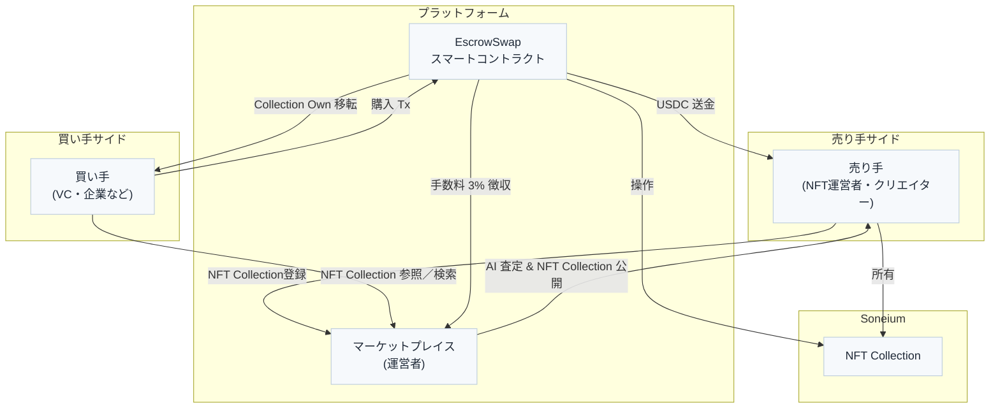
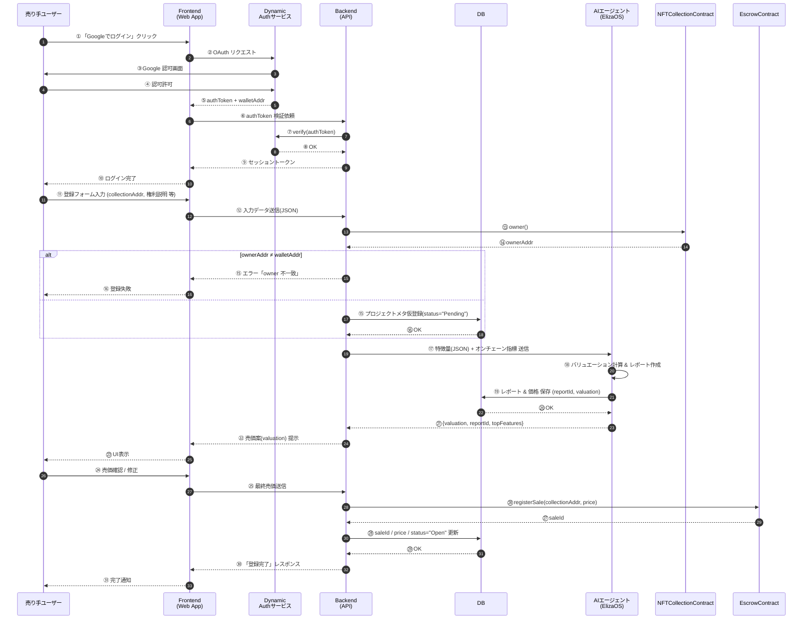
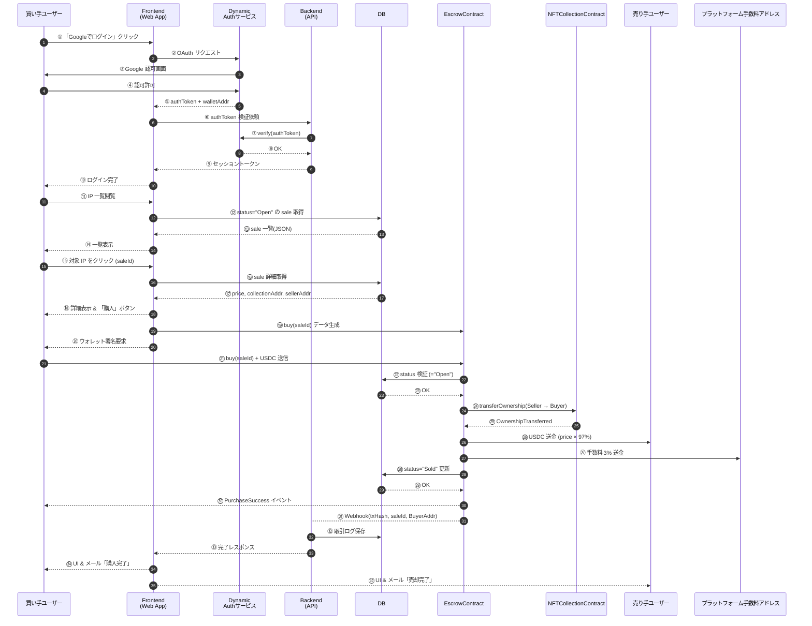

# 1. 概要

## 1.1 NFT IP マーケットとは？

既に発行・流通している **NFT コレクション（＝デジタル IP）そのものを、安全かつワンストップで売買できる取引所** です。

"トークン単体" ではなく「**IP ＋コミュニティ＋スマートコントラクト管理権限**」をまとめて譲渡できる点が最大の特徴です。

---

## 1.2 ステークホルダー別の価値提案

### 1.2.1 売り手（クリエイター／運営会社）にとっての課題と価値

| 課題                            | NFT IP マーケットが提供する解決策                                                                                    |
| ------------------------------- | -------------------------------------------------------------------------------------------------------------------- |
| **Exit 不在**・M&A の窓口がない | - ウォレット署名だけで**IP を丸ごと売却**- AI が即時バリュエーション → 適正価格で出品- 売却代金は**USDC で即時受領** |
| **交渉の手間**                  | - 買い手候補をプラットフォームが自動マッチング                                                                       |

---

### 1.2.2 買い手（VC／ゲーム・アニメ・メディア企業）にとっての課題と価値

| 課題                         | NFT IP マーケットが提供する解決策                                                   |
| ---------------------------- | ----------------------------------------------------------------------------------- |
| **新規 IP 開発コストが高い** | - 既にファンを抱える IP を**一括取得**- コミュニティ・SNS・NFT 保有者をそのまま活用 |
| **権利関係の不透明さ**       | - ブロックチェーン上で owner 権限を移転 →**法的クリア**                             |
| **相場情報不足**             | - AI レポートで過去取引量・ロイヤルティ実績を可視化                                 |
| **キャッシュフローの即時性** | - USDC 決済 → 仕入れから利用までのタイムラグ最小                                    |

---

### 1.2.3 投資家・コミュニティ（保有ホルダー）にとっての課題と価値

| 期待                     | マーケットの効果                                                           |
| ------------------------ | -------------------------------------------------------------------------- |
| **プロジェクトの持続性** | - 事業者の運営が難しくなっても 引き継ぎにより IP 活性 → NFT の二次価値向上 |
| **透明な運営**           | - 取引履歴・レポートが公開され**ガバナンスが強化**                         |
| **流動性**               | - IP 毎の売買市場ができ、**EXIT ＝価値向上の機会**が明確に                 |

---

## 1.3 プラットフォームの価値創出

- **3 % の取引手数料** + 将来的なプレミアム機能課金
- AI 解析データを二次活用した **エコシステム SaaS** への展開
- 日本発の **IP 特化型デジタル M&A ハブ** としてポジショニング

---

## 1.4 市場機会

1. **NFT 市場の成熟**
   - 初期ブーム後、継続した運用に悩むプロジェクトが増加。
2. **Web3 × 既存コンテンツ産業の融合**
   - 大手ゲーム・アニメ企業が Web3 を模索するも、ゼロイチは高リスク。
3. **規制環境の明確化**
   - 日本でも「電子記録移転権利」への法整備が進み、デジタル IP 取引が合法的に。

---

## 1.5 まとめ

| ステークホルダー     | 一言で伝える価値                                                                     |
| -------------------- | ------------------------------------------------------------------------------------ |
| **売り手**           | 「プロジェクトを閉じる前に、"ファンごと" 欲しい企業へ高値で引き渡せます。」          |
| **買い手**           | 「ゼロからコミュニティを育てずに、即戦力 IP と熱量あるファンを獲得できます。」       |
| **ホルダー／投資家** | 「オーナー交代で IP が再生し、NFT の可能性を広げる"セカンドチャンス"が得られます。」 |

NFT IP マーケットは、**全ステークホルダーに"ウィン"をもたらす** 新しい流動性インフラです。

## 2. ビジネス要件

| 項目                   | 決定内容                                                                                                                                      |
| ---------------------- | --------------------------------------------------------------------------------------------------------------------------------------------- |
| **サービス目的**       | ①NFT IP 運営者が “出口戦略” として M&A を選択できる市場を創出 ② 買い手は既存ファンベース付き IP を取得して新規事業に活用                      |
| **現状の課題**         | - NFT プロジェクトは流動性が低く Exit が困難- 企業側は “ゼロ →IP 構築” のリスクが高い                                                         |
| **主要 KPI**           | - 年間流通総額 (GMV) 10  億円- 取引手数料収入 3 % →  初年度 3,000  万円- 上場件数  ≥ 50  コレクション                                         |
| **対象地域**           | 世界                                                                                                                                          |
| **収益モデル**         | 各取引額の **3 %** を徴収 (USDC 建て)                                                                                                         |
| **決済通貨**           | **USDC** (Soneium チェーン)                                                                                                                   |
| **ガバナンストークン** | なし                                                                                                                                          |
| **ステークホルダー**   | 売り手  =  個人クリエイター／運営会社／法人買い手  = VC、ゲーム・メディア・アニメ・漫画・ラノベ企業モデレーター DAO =  不要（運営が中央管理） |



## 2. 機能

### **2-1. ユーザー管理機能**

- **ユーザー登録・認証**
  - ログイン機能
  - 新規ユーザー登録

### **2-2. マーケットプレイス機能**

- **知的財産の一覧表示**
  - プロジェクト検索・フィルタリング
- **プロジェクト詳細表示**
  - 個別プロジェクト情報の閲覧
  - AI 分析レポートの閲覧

### **2-3. 知的財産取引機能**

- **NFT IP 管理**
  - NFT IP の出品
- **取引処理**
  - 取引履歴の管理
  - エスクロースマートコントラクトによる安全な取引

---

## 3. シーケンス





---

## 4. スマートコントラクト設計

| Contract   | 主責務                                                             |
| ---------- | ------------------------------------------------------------------ |
| **Escrow** | NFT コレクション取引の総合管理（エスクロー、権限移転、手数料処理） |

---

## 5. DB 設計

[/drizzle/migrations](https://github.com/yuforest/ip-market/blob/ec2f490264e81ea475a09de07f1f8c79ddd0b0d0/drizzle/migrations)参照

## 6. 技術構成

一つのリポジトリに Next.js、ElizaOS が入る想定

- フロントエンド: Next.js
- バックエンド: Next.js
- AI: ElizaOS
- 認証: Dynamic
- ブロックチェーン: Soneium
- node: SCS
- ORM: drizzle
- DB: NeonDB(Postgres-as-a-Service)、https://neon.tech/

## 7. 今後の展望：安全性 & コンプライアンス

- **KYC/KYB**: 初回出品 & 50 k USDC 超の購入で必須 (eKYC API)
- **知財チェック**: 商標 PDF ハッシュを IPFS に格納、運営が手動承認
- **AML**: ライブチェーン解析 (Chainalysis API) でハイリスクウォレット拒否
- ドキュメントを入力可能にすることで利便化

---

==============================================================================================

## Getting Started

First, run the development server:

```bash
npm run dev
# or
yarn dev
# or
pnpm dev
# or
bun dev
```

## Drizzle commands

`db/schema.ts`を変更したあと、
`npm run db:generate`(マイグレーションファイルの生成), `npm run db:migrate`(マイグレーションの実行)をすることで DB にスキーマを反映できる。
`npm run db:studio`を使うことで GUI から、DB の操作が可能となる。
